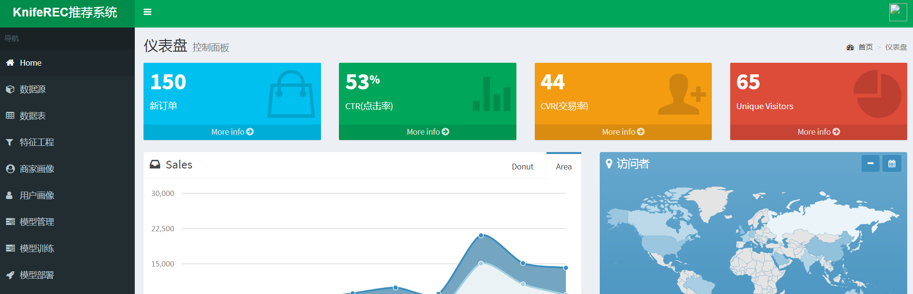

# KnifeREC 推荐系统

系统预览

## 安装

    pip install -r requirements.txt

## 使用

    python app.py
    
预测结果调用

    http://localhost:5000/predict

## Features

1.数据源管理；
2.数据预处理；
3.模型管理；
4.模型输出；
5.策略管理；
6.模型监控；

## 参与贡献

欢迎参与贡献开发

QQ群：747460350

[功能设计](./doc/design.md)

### 技术支持

<a href="mailto:zergskj@163.com">夜半饿得慌</a>
